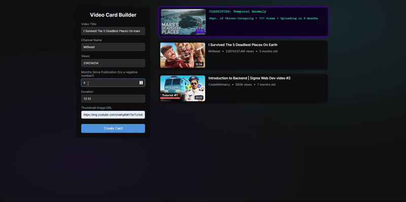

# Sigma Web Development - Exercise 13: Dynamic Video Card Builder

This repository contains my solution for Exercise 13 of the Sigma Web Development course. The project demonstrates how to dynamically create and manipulate the DOM with JavaScript, evolving from a simple static card into a full interactive application.

---

## 🚀 Final Application: The Dynamic Card Builder

The final version of this project is a complete web app that allows users to generate YouTube-style video cards by filling out a form. It's built with modern HTML, CSS, and vanilla JavaScript.

### Key Features of the Final App:

-   **Dynamic DOM Creation:** All video cards are created and added to the page entirely with JavaScript.
-   **Interactive Form:** Captures user input to generate custom cards in real-time.
-   **Reusable Helper Functions:** Clean, reusable functions handle the formatting of data like view counts and video age.
-   **Creative "Easter Egg":** A hidden "Temporal Anomaly" card appears if you enter a negative number for the months!

---

## 🌱 Project Evolution: From Static to Dynamic

This project was built in two main stages, showing a clear progression of skills.

### Stage 1: The Basic Static Card

The initial exercise was to populate a single, hard-coded HTML card with data from a JavaScript function. This demonstrated a basic understanding of DOM selection (`querySelector`) and content manipulation (`textContent`). This "core" version can be found in the `01-basic-static-version` folder.

### Stage 2: The Enhanced Dynamic App

The project was then evolved into a full application by:
-   Creating a form to capture user data.
-   Writing JavaScript to dynamically create all HTML elements from scratch (`createElement`).
-   Adding logic to prepend new cards to a container, allowing for multiple creations.
-   Building a more robust and modular codebase.

This evolution from a simple script to a full application shows a strong understanding of how to build interactive web experiences.

---

## 🛠️ Tech Stack

-   **HTML5**
-   **CSS3** (Flexbox, Modern Layouts)
-   **JavaScript (ES6+)** (DOM Manipulation, Event Listeners, Form Handling)

## 🙏 Acknowledgements

-   This project is part of the **Sigma Web Development Course** by **CodeWithHarry**.
